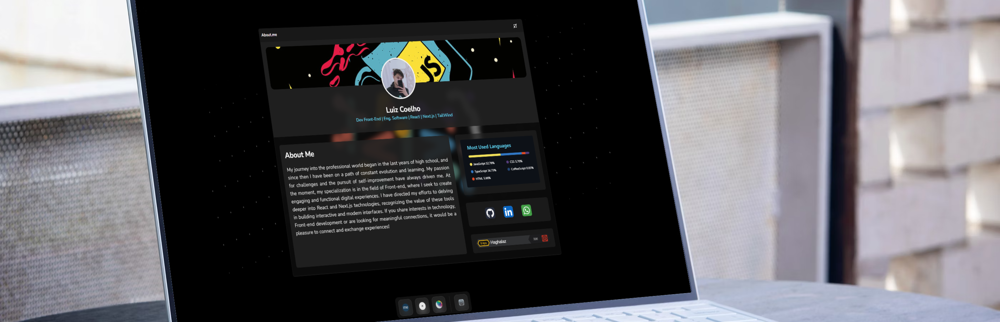

### 

## GitHub Stats

   
  
  

 

## Codewars

 

## My Skill Set
### Dev

 

### UI 

 

### Softwares

 

### DevOps

 

### Hobbies

 

## Portfolio

Check out the portfolio [here](https://haghalaz.github.io/portfolio/).
  

  <h2> Contact me </h2>
  

    
    
  

  

